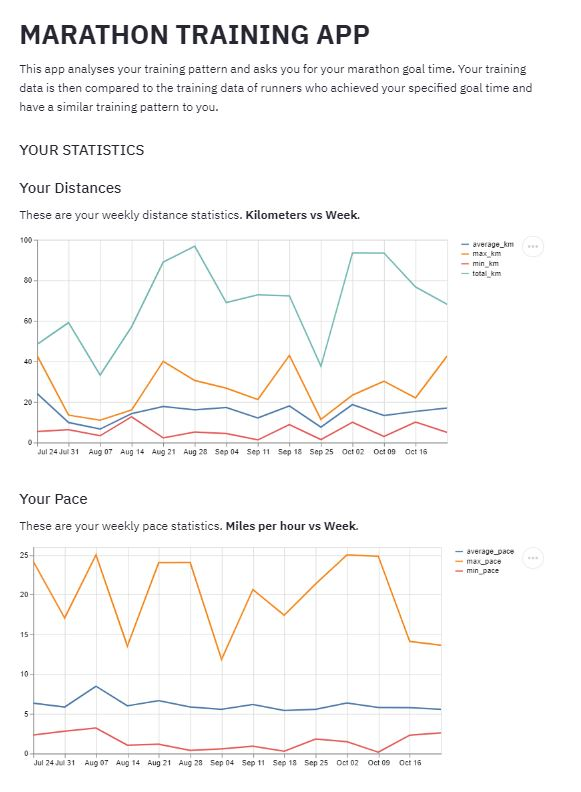
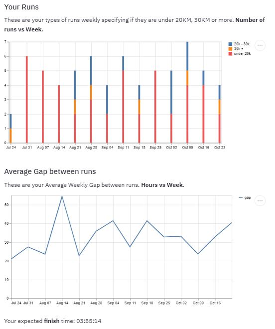
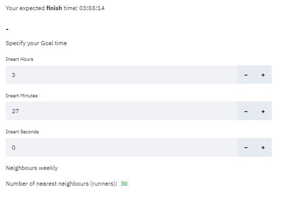
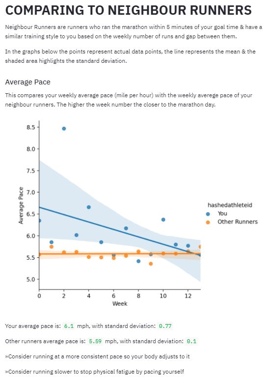
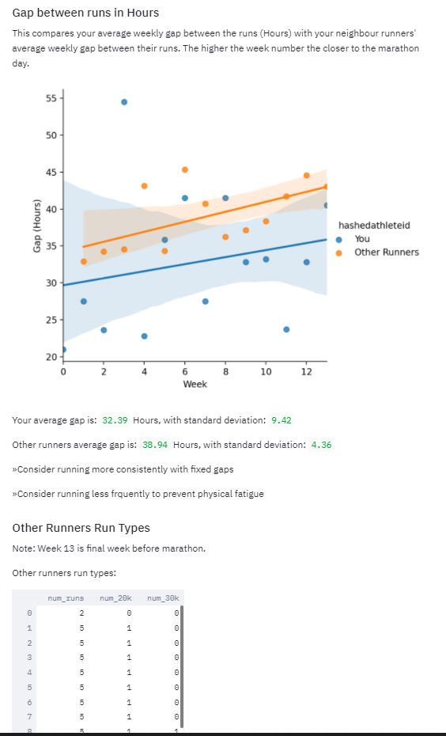
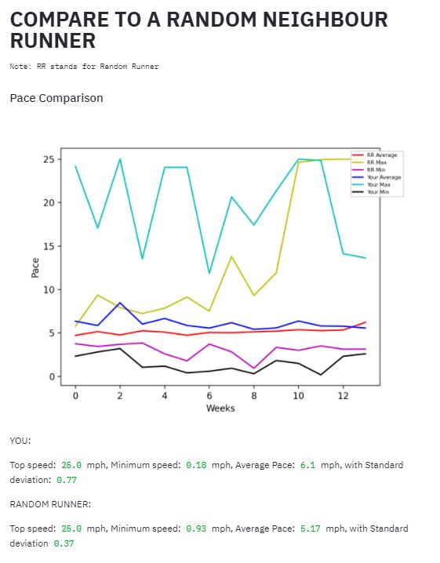
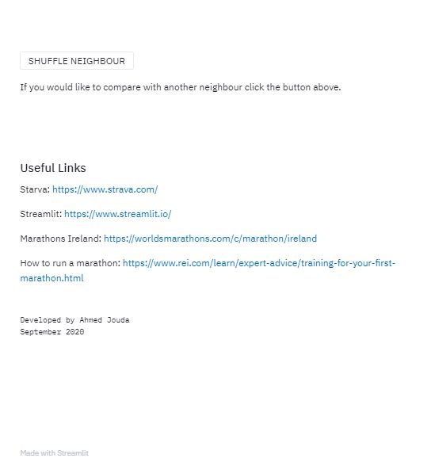

# Marathon Training App
Training recommendations app using **Streamlit** for marathon runners based on Dublin Marathon 2016 data from the running app **Strava** as part of my internship with **Insight Centre for Data Analytics**.  

## Getting started
Streamlit is an open-source Python library that makes it easy to build beautiful custom web-apps for machine learning and data science. You can find more information about it [here](https://www.streamlit.io/).
1. Install using the command **pip install streamlit**.
2. Open a python text editor and import streamlit like any other library. [My favorite text editor is VS Code](https://code.visualstudio.com/).
3. Copy the code in the file **"advancedapp.py"** in the folder **"Streamlit"** into your text editor. 
4. Run the script in your terminal using **streamlit run advancedapp.py**
5. The app will open up in your browser!

##### Note: If you have different marathon data not from Strava this won't work as the dataframe attributes will be different. You must change the name of the pickle file being read in the code if its a different one.

## App Features & Algorithm
### Overall
The app analyses the user's training pattern and asks the user for their marathon goal time. The user's training data is graphed, then its is compared and contrasted with the training data of runners who acheived the specified goal time as well as having a similar training pattern to the user based on number of runs and gap between the runs.

### Specific features
1. **User's training displayed**  
* The user's training data for the past weeks is graphed based on attributes such as pace, distance, gap and number of runs.
  
* The user is also given an expected marathon finish time if they keep up the same training pattern.
  

2. **Specifying a Goal Time**  
* The user can then specify a goal time that they want to achieve. An algorithm is ran here by the app to find runners who acheived this goal time and have a similar training pattern to the user. They are called ***neighbours***.  
* The algorithm consists of 2 steps:  
  * Find runners who finished the marathon within 5 minutes of the user's specified goal time.
  * Out of those runners find the KNN (K nearest neighbours) to the user based on number of runs and the gap between the runs, thus having a similar training pattern.
  

3. **Comparison and Recommednation**  
* Now all the neighbours' data is averaged and is graphed alongside the data of the user based on attributes such as: average pace, average distance, total distance, gap & number of runs. After each illustration recommendations are given to the user on how they can improve their training to make it more like that of the other runners.  
* Below are only two of five illustrations:  

  

4. **Comparison with a Random Neighbour**  
* The app then compares the user's training data to the training data of one of the neighbours picked at random to put things more into prespective in case the user prefers to replicate the training of that user.   
* Below is just one of multiple comparative illustrations between the user and random neighbour:  
  

5. **Shuffling the Random Neighbour**
* A button can be pressed to compare the user's data with the data of another random neighbour. The shuffle button can be pressed as often as the user likes and it will keep finding another random neighbour.  

6. **Ending**
* At the bottom of the app a list of useful links is present.  

## Remaining Folders in this Repository
### Dash  
* This includes all the trials to build the webapp/dashboard using Dash.  
* Files:  
 * **Trial.py:** First attempt at using Dash.
 * **Trial2.py:** Attempt at formatting a Dash webapp.
 * **App.py:** First attempt of running app.
 * **App2.py:** Redo of the first attempt.
 * **App3.py:** Final app that was meant to be a copy of the streamlit app.  
 
### Jupyter Notebooks  
* This folder contains all the notebooks used for analysis of the data. I built all the app features into a notebook first and then transferred them into streamlit.  
* Files:  
 * **Final Advanced Streamlit App.ipynb:** Contains the final notebook that contains all the app features.
 * **Pickling.ipynb:** Filters the original marathon runners data pickle file and makes it smaller. The data is cleaned and the file is pickled again.
 * **Advanced Streamlit App.ipynb:** A previous version of the app with less features.
 * **Streamlit Final.ipynb:** A previous version with less functionality.
 * **Streamlit Base.ipynb:** The first, most basic, working version.
 * **initial_data_analysis.ipynb:** The first time the data was manipulated to find out what is in it.
 * **trial_push1.ipynb:** Testing the repository.  
 
### Pictures  
* This folder contains screenshots from the final app.

### Research & Documentation  
* This folder contains all the updates, research findings and documentation done during the process of preparation and developement of the app.  
* Files:  
 * **App Design.pdf:** Contains the first basic app design in words and drawn out on paper.
 * **Software Comparison.pdf:** Comparison between potential softwars to be used to build the app. Streamlit was chosen.
 * **Streamlit Basic App Documentation.pdf:** Explaination of how the Basic App works.  
 
 ### Streamlit  
* This folder contains all the code for the web apps built using Streamlit.  
* Files:  
 * **advancedapp.py** Contains the first basic app design in words and drawn out on paper.
 * **app1.py:** Very basic attempt at the basic app.
 * **app2.py:** Seconds basic attempt at the basic app.
 * **basicapp.py:** The basic app design completed.
 * **finalapp.py:** First version of the final app.
 * **trial.py:** Testing streamlit with pre written code.  

## Useful Links  
* https://jakevdp.github.io/PythonDataScienceHandbook/
* https://www.amazon.co.uk/Python-Data-Analysis-Wrangling-IPython/dp/1449319793 
* https://github.com/Jffrank/Books/blob/master/Python%20for%20Data%20Analysis.%20Data%20Wrangling%20with%20Pandas%2C%20NumPy%2C%20and%20IPython%20(2017%2C%20O%E2%80%99Reilly).pdf

## Author
*Ahmed Jouda*, Computer Science with Data Science student at University College Dublin  
Mentored by *Dr. Aonghus Lawlor*
